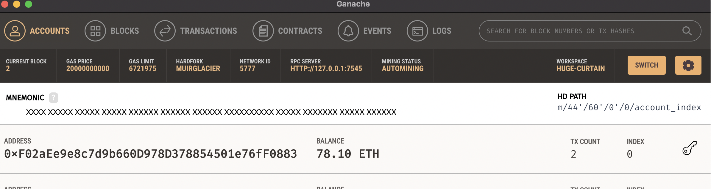
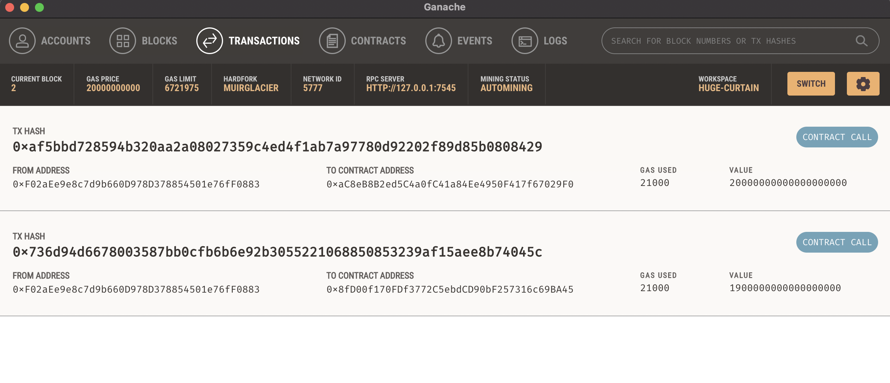

# Fintech-Finder

This is an application that is use find fintech professionals from among a list of candidates, hire them, and pay them in cryptocurrency.


## Technologies

This project uses python 3.9 with the following:

* [jupyter](https://jupyter.org/)

* [streamlit](https://docs.python.org/3/library/hashlib.html)

* [web3](https://web3py.readthedocs.io/)

* [ganache](https://trufflesuite.com/ganache/)

* [bip44](https://pypi.org/project/bip44/)

## Usage

Ensure that all dependencies are installed

Download and install [ganache](https://trufflesuite.com/docs/ganache/quickstart/#1-install-ganache).

Install Streamlit
```
pip install streamlit
```

Run the streamlit application.
```
streamlit run fintech_finder.py
```

When the application starts, it will bring up a page with the sidebar to select/send transaction and the right(main portion) showing the candidates and rates.


Upon selecting a candidate, input the number of hours and hit `Send Transaction` to pay


From the Ganache UI, the address show the remaining balance and total transactions


From the transactions tab, it will show the transaction hashes and details



## Contributors

Contributed by [Theena Dang](maria.cristina.dang@gmail.com)

---

## License

[MIT](LICENSE)
